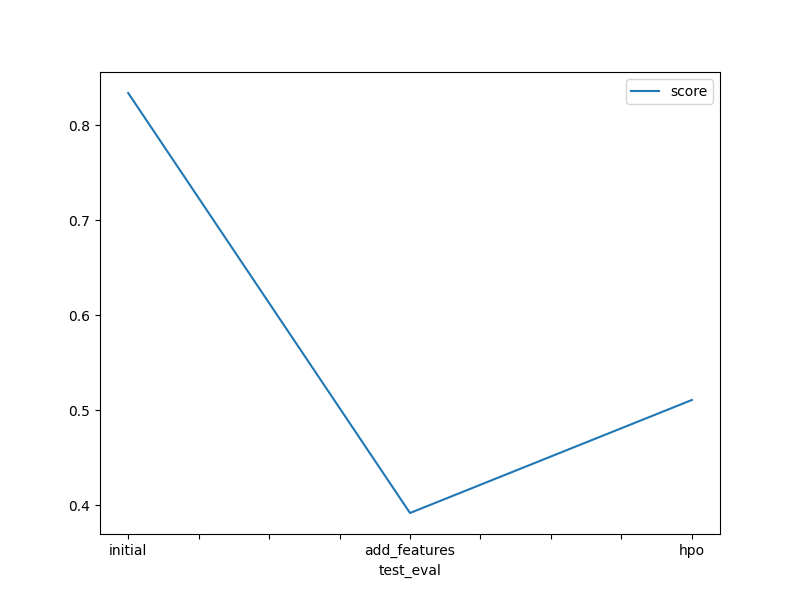

# Report: Predict Bike Sharing Demand with AutoGluon Solution
#### JÉSSICA DOMINGUES LAMOSA

## Initial Training
### What did you realize when you tried to submit your predictions? What changes were needed to the output of the predictor to submit your results?
Firstly, I needed to ignore the "casual" and "registered" columns, these features were not present in test.csv
Also, Kaggle will reject the submission if we don't set everything to be > 0, so it was necessary to do this treatment.

### What was the top ranked model that performed?
0      WeightedEnsemble_L3  -29.229745       0.553013  503.461138                0.000255           0.102072            3       True         13

## Exploratory data analysis and feature creation
### What did the exploratory analysis find and how did you add additional features?
During the analysis it was possible to observe some negative values in forecasts that needed to be converted to 0. With the describe() function it was possible to observe the following values:

count 6493.000000

mean 133.735245

std 107.665695

min -4.014292

25% 55.329243

50% 111.014687

75% 179.776245

max 725.000122

In order for autogluon to convert the date to integers, the datetime column needed to be converted to datetime format. So I created a column for year, week, hour and day of the week using datetime.

### How much better did your model preform after adding additional features and why do you think that is?
Score in kaggle improved from 0.83412 to 0.39187, I think this happened because by adding year to the model it helps to predict the bike share count by year.

## Hyper parameter tuning
### How much better did your model preform after trying different hyper parameters?
The score was 0.39187 and became 0.51086 it means decrease in the kaggle score, I think this happened because I need to choose better de hyper parameters. 

### If you were given more time with this dataset, where do you think you would spend more time?
I think that I would spend more time doing feature engineering.

### Create a table with the models you ran, the hyperparameters modified, and the kaggle score.
|model|GBM|XGB|CAT|score|
|--|--|--|--|--|
|initial|default|default|default|0.83412|
|add_features|year,day,week,weekday|year,day,week,weekday|year,day,week,weekday|0.39187|
|hpo|'GBM':{'num_iterations':200, 'learning_rate':0.1}|'XGB':{'objective':'reg:squarederror', 'max_depth':10, 'eta':0.40}|'CAT':{'depth':10,'learning_rate':0.1}|0.51086|

### Create a line plot showing the top model score for the three (or more) training runs during the project.

### Create a line plot showing the top kaggle score for the three (or more) prediction submissions during the project.

## Summary
With autogloun it is possible to combine outputs from RandomForest, CatBoost, k-nearest neighbors and others to further improve model accuracy. AutoGluon-Tabular introduces a new way of stacking multiple layers of models.

In the tests performed, after the date treatment, the autogloun presented a good performance.

Click [here](https://aws.amazon.com/blogs/opensource/machine-learning-with-autogluon-an-open-source-automl-library/) if you want to know more about AutoGluon-Tabular 
